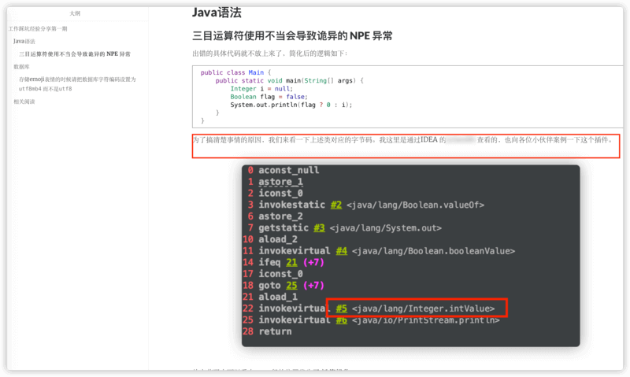
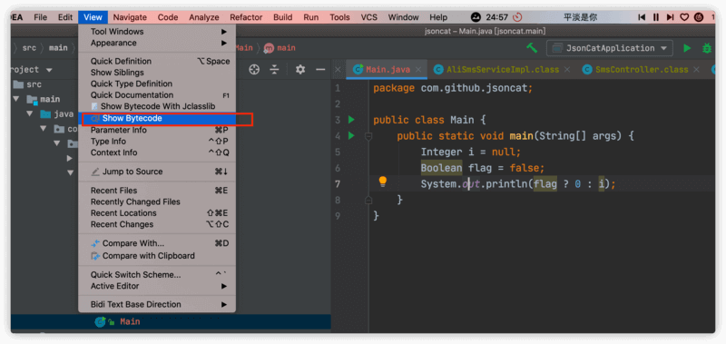
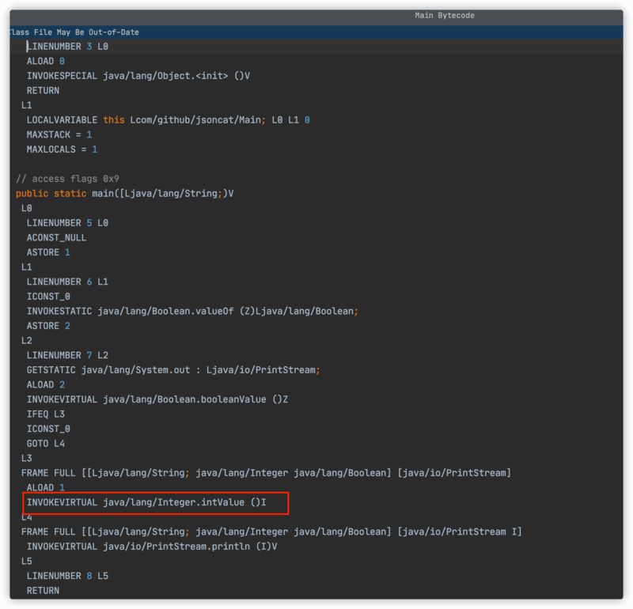
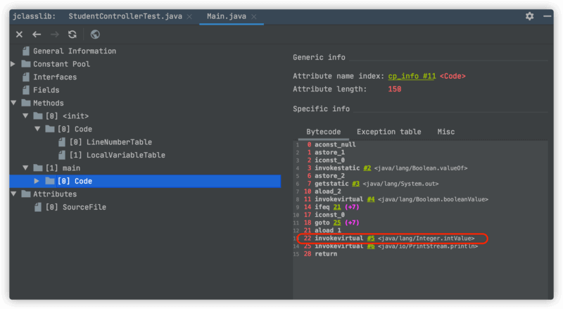
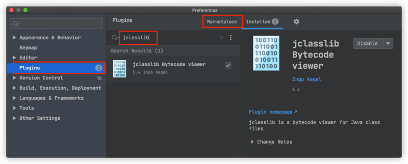
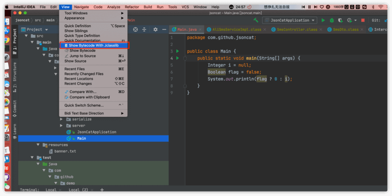

由于后面要分享的一篇文章中用到了这篇文章要推荐的一个插件，所以这里分享一下。非常实用！你会爱上它的！



**开始推荐 IDEA 字节码查看神器之前，先来回顾一下 Java 字节码是啥。**

## 何为 Java 字节码?

Java 虚拟机（JVM）是运行 Java 字节码的虚拟机。JVM 有针对不同系统的特定实现（Windows，Linux，macOS），目的是使用相同的字节码，它们都会给出相同的结果。

**什么是字节码?采用字节码的好处是什么?**

> 在 Java 中，JVM 可以理解的代码就叫做`字节码`（即扩展名为 `.class` 的文件），它不面向任何特定的处理器，只面向虚拟机。Java 语言通过字节码的方式，在一定程度上解决了传统解释型语言执行效率低的问题，同时又保留了解释型语言可移植的特点。所以 Java 程序运行时比较高效，而且，由于字节码并不针对一种特定的机器，因此，Java 程序无须重新编译便可在多种不同操作系统的计算机上运行。

**Java 程序从源代码到运行一般有下面 3 步：**


## 为什么要查看 Java 字节码？

我们在平时学习的时候，经常需要查看某个 java 类的字节码文件。查看字节码文件更容易让我们搞懂 java 代码背后的原理比如搞懂 java 中的各种语法糖的本质。

## 如何查看 Java 字节码?

如果我们通过命令行来查看某个 class 的字节码文件的话，可以直接通过 `javap` 命令，不过这种方式太原始了，效率十分低，并且看起来不直观。

下面介绍两种使用 IDEA 查看类对应字节码文件的方式（_`javap`这种方式就不提了_）。

我们以这段代码作为案例:

```java
public class Main {
    public static void main(String[] args) {
        Integer i = null;
        Boolean flag = false;
        System.out.println(flag ? 0 : i);
    }
}
```

上面这段代码由于使用三目运算符不当导致诡异了 NPE 异常。为了搞清楚事情的原因，我们来看其对应的字节码。

### 使用 IDEA 自带功能

我们点击 `View -> Show Bytecode` 即可通过 IDEA 查看某个类对应的字节码文件。

> 需要注意的是：**查看某个类对应的字节码文件之前确保它已经被编译过。**



稍等几秒钟之后，你就可以直观到看到对应的类的字节码内容了。



从字节码中可以看出，我圈出来的位置发生了 **拆箱操作** 。

> - **装箱**：将基本类型用它们对应的引用类型包装起来；
> - **拆箱**：将包装类型转换为基本数据类型；

详细解释下就是：`flag ? 0 : i` 这行代码中，0 是基本数据类型 int，返回数据的时候 i 会被强制拆箱成 int 类型，由于 i 的值是 null，因此就抛出了 NPE 异常。

```java
Integer i = null;
Boolean flag = false;
System.out.println(flag ? 0 : i);
```

如果，我们把代码中 `flag` 变量的值修改为 true 的话，就不会存在 NPE 问题了，因为会直接返回 0，不会进行拆箱操作。

### 使用 IDEA 插件 jclasslib(推荐)

相比于 IDEA 自带的查看类字节的功能，我更推荐 `jclasslib` 这个插件，非常棒！

**使用 `jclasslib` 不光可以直观地查看某个类对应的字节码文件，还可以查看类的基本信息、常量池、接口、属性、函数等信息。**



我们直接在 IDEA 的插件市场即可找到这个插件。我这里已经安装好了。



安装完成之后，重启 IDEA。点击`View -> Show Bytecode With jclasslib` 即可通过`jclasslib` 查看某个类对应的字节码文件。

