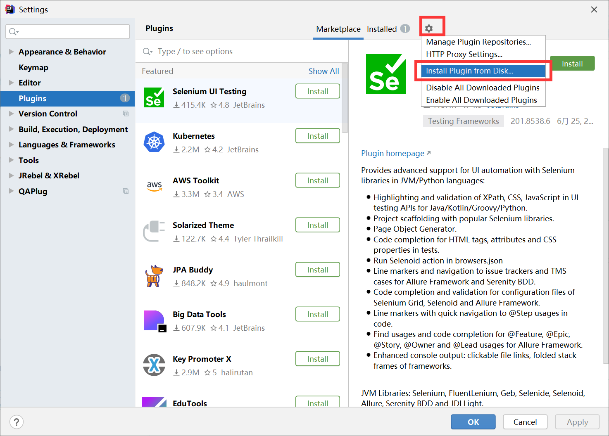

我这个人没事就喜欢推荐一些好用的 [IDEA 插件](https://mp.weixin.qq.com/mp/appmsgalbum?action=getalbum&album_id=1319419426898329600&__biz=Mzg2OTA0Njk0OA==#wechat_redirect)给大家。这些插件极大程度上提高了我们的生产效率以及编码舒适度。

**不知道大家有没有想过自己开发一款 IDEA 插件呢？**

我自己想过，但是没去尝试过。刚好有一位读者想让我写一篇入门 IDEA 开发的文章，所以，我在周末就花了一会时间简单了解一下。


不过，**这篇文章只是简单带各位小伙伴入门一下 IDEA 插件开发**，个人精力有限，暂时不会深入探讨太多。如果你已经有 IDEA 插件开发的相关经验的话，这篇文章就可以不用看了，因为会浪费你 3 分钟的时间。

好的废话不多说！咱们直接开始!

## 01 新建一个基于 Gradle 的插件项目

这里我们基于 Gradle 进行插件开发，这也是 IntelliJ 官方的推荐的插件开发解决方案。

**第一步，选择 Gradle 项目类型并勾选上相应的依赖。**


**第二步，填写项目相关的属性比如 GroupId、ArtifactId。**


**第三步，静静等待项目下载相关依赖。**

第一次创建 IDEA 插件项目的话，这一步会比较慢。因为要下载 IDEA 插件开发所需的 SDK 。

## 02 插件项目结构概览

新建完成的项目结构如下图所示。


这里需要额外注意的是下面这两个配置文件。

**`plugin.xml`: 插件的核心配置文件。通过它可以配置插件名称、插件介绍、插件作者信息、Action 等信息。**

```xml
<idea-plugin>
    <id>github.javaguide.my-first-idea-plugin</id>
    <!--插件的名称-->
    <name>Beauty</name>
    <!--插件的作者相关信息-->
    <vendor email="koushuangbwcx@163.com" url="https://github.com/Snailclimb">JavaGuide</vendor>
    <!--插件的介绍-->
    <description><![CDATA[
     Guide哥代码开发的第一款IDEA 插件<br>
    <em>这尼玛是什么垃圾插件！！！</em>
    ]]></description>

    <!-- please see https://www.jetbrains.org/intellij/sdk/docs/basics/getting_started/plugin_compatibility.html
         on how to target different products -->
    <depends>com.intellij.modules.platform</depends>

    <extensions defaultExtensionNs="com.intellij">
        <!-- Add your extensions here -->
    </extensions>

    <actions>
        <!-- Add your actions here -->
    </actions>
</idea-plugin>
```

**`build.gradle`: 项目依赖配置文件。通过它可以配置项目第三方依赖、插件版本、插件版本更新记录等信息。**

```groovy
plugins {
    id 'java'
    id 'org.jetbrains.intellij' version '0.6.3'
}

group 'github.javaguide'
// 当前插件版本
version '1.0-SNAPSHOT'

repositories {
    mavenCentral()
}

// 项目依赖
dependencies {
    testCompile group: 'junit', name: 'junit', version: '4.12'
}

// See https://github.com/JetBrains/gradle-intellij-plugin/
// 当前开发该插件的 IDEA 版本
intellij {
    version '2020.1.2'
}
patchPluginXml {
    // 版本更新记录
    changeNotes """
      Add change notes here.<br>
      <em>most HTML tags may be used</em>"""
}
```

没有开发过 IDEA 插件的小伙伴直接看这两个配置文件内容可能会有点蒙。所以，我专门找了一个 IDEA 插件市场提供的现成插件来说明一下。小伙伴们对照下面这张图来看下面的配置文件内容就非常非常清晰了。


这就非常贴心了！如果这都不能让你点赞，我要这文章有何用!


## 03 手动创建 Action

我们可以把 Action 看作是 IDEA 提供的事件响应处理器，通过 Action 我们可以自定义一些事件处理逻辑/动作。比如说你点击某个菜单的时候，我们进行一个展示对话框的操作。

**第一步，右键 `java` 目录并选择 new 一个 Action**

.png>)

**第二步，配置 Action 相关信息比如展示名称。**

.png>)

创建完成之后，我们的 `plugin.xml` 的 `<actions>`节点下会自动生成我们刚刚创建的 Action 信息:

```xml
<actions>
    <!-- Add your actions here -->
    <action id="test.hello" class="HelloAction" text="Hello" description="IDEA 插件入门">
      <add-to-group group-id="ToolsMenu" anchor="first"/>
    </action>
</actions>
```

并且 `java` 目录下会生成一个叫做 `HelloAction` 的类。这个类继承了 `AnAction` ，并覆盖了 `actionPerformed()` 方法。这个 `actionPerformed` 方法就好比 JS 中的 `onClick` 方法，会在你点击的时候触发对应的动作。

我简单对 `actionPerformed` 方法进行了修改，添加了一行代码。这行代码很简单，就是显示 1 个对话框并展示一些信息。

```java
public class HelloAction extends AnAction {

    @Override
    public void actionPerformed(AnActionEvent e) {
        //显示对话框并展示对应的信息
        Messages.showInfoMessage("素材不够，插件来凑！", "Hello");
    }
}

```

另外，我们上面也说了，每个动作都会归属到一个 Group 中，这个 Group 可以简单看作 IDEA 中已经存在的菜单。

举个例子。我上面创建的 Action 的所属 Group 是 **ToolsMenu(Tools)** 。这样的话，我们创建的 Action 所在的位置就在 Tools 这个菜单下。


再举个例子。加入我上面创建的 Action 所属的 Group 是**MainMenu** （IDEA 最上方的主菜单栏）下的 **FileMenu(File)** 的话。

```xml
<actions>
    <!-- Add your actions here -->
    <action id="test.hello" class="HelloAction" text="Hello" description="IDEA 插件入门">
      <add-to-group group-id="FileMenu" anchor="first"/>
    </action>
</actions>
```

我们创建的 Action 所在的位置就在 File 这个菜单下。


## 04 验收成果

点击 `Gradle -> Tasks -> intellij -> runIde` 就会启动一个默认了这个插件的 IDEA。然后，你可以在这个 IDEA 上实际使用这个插件了。


效果如下:


我们点击自定义的 Hello Action 的话就会弹出一个对话框并展示出我们自定义的信息。


## 05 完善一下

想要弄点界面花里胡哨一下， 我们还可以通过 Swing 来写一个界面。

这里我们简单实现一个聊天机器人。代码的话，我是直接参考的我大二刚学 Java 那会写的一个小项目（_当时写的代码实在太烂了！就很菜！_）。


首先，你需要在[图灵机器人官网](http://www.tuling123.com/ "图灵机器人官网")申请一个机器人。（_其他机器人也一样，感觉这个图灵机器人没有原来好用了，并且免费调用次数也不多_）


然后，简单写一个方法来请求调用机器人。由于代码比较简单，我这里就不放出来了，大家简单看一下效果就好。


## 06 打包分发

插件写好之后，如果我们想把插件分享给小伙伴使用的话要怎么做呢。

### 首先，我们要打包插件

执行 Gradle -> Tasks -> intellij -> buildPlugin

执行完成后，项目中会生成一个 build 文件夹，点击进入后找到 distributions 文件夹，里面会出现一个 .zip 结尾的压缩包，里面打包了插件所需要的依赖、配置文件等。

### 其次，分发插件

打开 IDEA，在 Settings -> Plugins -> 点击小齿轮后选择 Install Plugin From Disk



### 最后，提交至官网

这步并不是必须的，如果你想把你的插件发布到官网上，别人直接可以在 [应用市场](https://plugins.jetbrains.com/) 中搜到你的插件的话可以做这步。

## 07 深入学习

如果你想要深入学习的 IDEA 插件的话，可以看一下 [官网文档](https://jetbrains.org/intellij/sdk/docs/basics/basics.html)。

这方面的资料还是比较少的。除了官方文档的话，你还可以简单看看下面这几篇文章:

- [8 条经验轻松上手 IDEA 插件开发](https://developer.aliyun.com/article/777850?spm=a2c6h.12873581.0.dArticle777850.118d6446r096V4&groupCode=alitech "8 条经验轻松上手 IDEA 插件开发")
- [IDEA 插件开发入门教程](https://blog.xiaohansong.com/idea-plugin-development.html "IDEA 插件开发入门教程")

## 08 后记

我们开发 IDEA 插件主要是为了让 IDEA 更加好用，比如有些框架使用之后可以减少重复代码的编写、有些主题类型的插件可以让你的 IDEA 更好看。

我这篇文章的这个案例说实话只是为了让大家简单入门一下 IDEA 开发，没有任何实际应用意义。**如果你想要开发一个不错的 IDEA 插件的话，还要充分发挥想象，利用 IDEA 插件平台的能力。**

## 常见问题一: JDK 版本过低

创建好项目之后，运行 Gradle，出现如下报错

```
FAILURE: Build failed with an exception.

* What went wrong:
A problem occurred configuring root project 'string-template-error-scanner'.
> Could not resolve all artifacts for configuration ':classpath'.
   > Could not resolve org.jetbrains.intellij.plugins:gradle-intellij-plugin:1.4.0.
     Required by:
         project: > org.jetbrains.intellij:org.jetbrains.intellij.gradle.plugin:1.4.0
      > Unable to find a matching variant of org.jetbrains.intellij.plugins:gradle-intellij-plugin:1.4.0:
          - Variant 'apiElements' capability org.jetbrains.intellij.plugins:gradle-intellij-plugin:1.4.0:
              - Incompatible attributes:
                  - Required org.gradle.jvm.version '8' and found incompatible value '11'.
                  - Required org.gradle.usage 'java-runtime' and found incompatible value 'java-api'.
              - Other attributes:
                  - Found org.gradle.category 'library' but wasn't required.
                  - Required org.gradle.dependency.bundling 'external' and found compatible value 'external'.
                  - Found org.gradle.jvm.environment 'standard-jvm' but wasn't required.
                  - Required org.gradle.libraryelements 'jar' and found compatible value 'jar'.
                  - Found org.gradle.status 'release' but wasn't required.
                  - Found org.jetbrains.kotlin.platform.type 'jvm' but wasn't required.
          - Variant 'runtimeElements' capability org.jetbrains.intellij.plugins:gradle-intellij-plugin:1.4.0:
              - Incompatible attribute:
                  - Required org.gradle.jvm.version '8' and found incompatible value '11'.
              - Other attributes:
                  - Found org.gradle.category 'library' but wasn't required.
                  - Required org.gradle.dependency.bundling 'external' and found compatible value 'external'.
                  - Found org.gradle.jvm.environment 'standard-jvm' but wasn't required.
                  - Required org.gradle.libraryelements 'jar' and found compatible value 'jar'.
                  - Found org.gradle.status 'release' but wasn't required.
                  - Required org.gradle.usage 'java-runtime' and found compatible value 'java-runtime'.
                  - Found org.jetbrains.kotlin.platform.type 'jvm' but wasn't required.

* Try:
Run with --stacktrace option to get the stack trace. Run with --info or --debug option to get more log output. Run with --scan to get full insights.

* Get more help at https://help.gradle.org

BUILD FAILED in 94ms
```

> 原因分析: 一般情况下，我们都是使用 JDK8 进行开发，但是新版的 IDEA 插件的编译需要使用 JAVA11 版本以上，因此要把 JDK8 换成 JDK11。（设置方法: 左上角点击 Settings -> Build, Execution, Deployment, Build Tools -> Gradle，在下面找到 Gradle JVM: 改成 Java11 再次运行 Gradle 即可）

## 常见问题二: 无法创建 org.jetbrains.intellij.utils.ArchiveUtils 的实例

```
Build file 'D:\project\string-template-error-scanner\build.gradle' line: 3

An exception occurred applying plugin request [id: 'org.jetbrains.intellij', version: '1.4.0']
> Failed to apply plugin [id 'org.jetbrains.intellij']
   > Could not create an instance of type org.jetbrains.intellij.utils.ArchiveUtils.
      > Could not generate a decorated class for type ArchiveUtils.
         > org/gradle/api/file/ArchiveOperations

```

> 原因分析: 这个问题我在 StackOverFlow、CSDN 等等网站搜了一大圈都从根源上找到怎么解决（知道的小伙伴可以编辑此页和我说一下~）
>
> 最后通过修改 `build.gradle` 中 org.jetbrains.intellij 的版本解决的，我创建好项目之后版本是 1.4.0，换成 0.6.3，再重新运行一次 Gradle 就可以了
